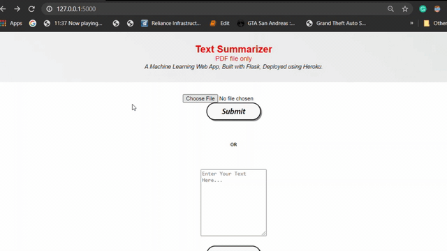

# TEXT SUMMARIZER

• This repository consists of files required to deploy a ___Machine Learning Web App___ created with ___Flask___ on ___Heroku___ platform.

• Please do ⭐ the repository, if it helped you in anyway.

• A glimpse of the web app:

